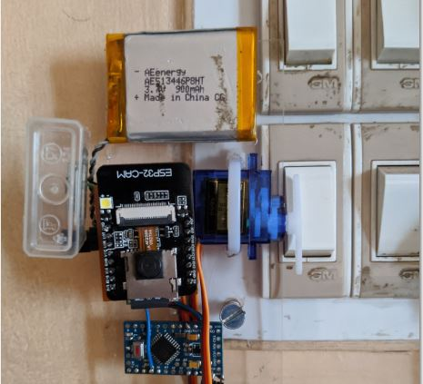

# PyroLight
Automated switch bot for switches using Kemet SS-430 Sensor 

Project Link:
[PyroLight](https://www.hackster.io/vishwasnavada/pyrolight-1d4a31)

##  Initial Protype image

## Final PCB Version
### Frontside 

### Backside 

### 3D View

Here's the video Link:

I referred schematics from olimex for the esp 32 charging circuit.
